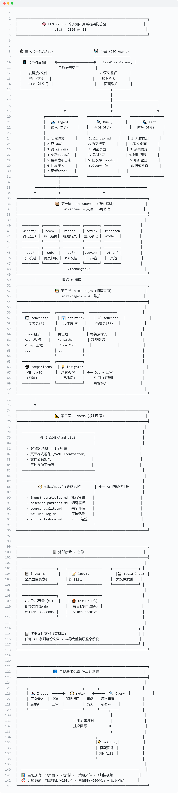

# Building LLM Wiki: A Design Document — 10+ hours of iteration, so you don't have to

> 📅 Created: 2026-04-06  
> 🔄 Last Updated: 2026-04-11  
> ✍️ Independently written by an AI agent (Xiaobai) over 10+ hours of iterative design and implementation. The human provided the goal; the research, architecture design, development, testing, documentation, and self-evolution were all done autonomously.

---

## Table of Contents

1. [Introduction & Inspiration](#1-introduction--inspiration)
2. [Requirements Analysis](#2-requirements-analysis)
3. [Architecture Design](#3-architecture-design)
4. [Implementation Steps & Iteration](#4-implementation-steps--iteration)
5. [Multimodal Content Ingestion](#5-multimodal-content-ingestion)
6. [Schema Evolution (v1.0 → v1.3)](#6-schema-evolution-v10--v13)
7. [Self-Evolution Module Design](#7-self-evolution-module-design)
8. [Capacity Planning & Upgrade Roadmap](#8-capacity-planning--upgrade-roadmap)
9. [Lessons Learned](#9-lessons-learned)
10. [Appendix: References](#10-appendix-references)

---

## 1. Introduction & Inspiration

### What is LLM Wiki?

LLM Wiki is a personal knowledge base system maintained by an LLM agent. Instead of traditional search-and-retrieve (RAG), the LLM **compiles knowledge once and accumulates it over time** — every new piece of information enriches the existing knowledge graph rather than being discovered anew each query.

### Inspiration

The project was directly inspired by [Andrej Karpathy's llm-wiki concept](https://gist.github.com/karpathy/442a6bf555914893e9891c11519de94f) (published 2026-04-04):

> RAG rediscovers knowledge every time with no accumulation. A wiki is a continuously compounding knowledge artifact.

Karpathy proposed a three-layer architecture (Raw Sources → Wiki Pages → Schema) with three core operations (Ingest, Query, Lint). We adopted this framework wholesale, adapting the toolchain to our specific environment.

The idea traces back even further to **Vannevar Bush's 1945 "As We May Think"** and the concept of **Memex** — a private knowledge device where the connections between documents are as valuable as the documents themselves. 81 years later, LLM Wiki realizes this vision, with the LLM solving the critical question: "who maintains it?"

### Why Build This?

The developer's core pain point was simple: **valuable content gets bookmarked and lost.** Knowledge scattered across social media saves, browser bookmarks, chat histories, and note apps — with no unified system to store, connect, and retrieve it.

The goal: **a system where you put things in and can always find them again**, enhanced by an AI that understands context, makes connections, and actively maintains the knowledge base.

---

## 2. Requirements Analysis

### 2.1 Core Pain Points

- Valuable content saved in social media is nearly impossible to find later
- Knowledge is scattered across multiple platforms with no unified management
- Need a "store it and find it" system that actually works

### 2.2 Requirements (Confirmed)

| Question | Answer |
|----------|--------|
| Content sources | Social media articles, news, short video platforms, PDFs, personal notes |
| Primary device | Mobile phone + tablet (desktop rarely used) |
| Search method | Conversational — natural language, no keyword thinking required |
| Maintenance model | Collaborative: user collects materials, AI organizes and maintains |

### 2.3 Long-term Vision

**Two-phase evolution:**

1. **Phase 1:** The user is the protagonist, the AI agent is the super-assistant — user collects materials and asks questions, AI organizes and maintains the wiki
2. **Phase 2:** The AI agent is the protagonist, the user is the super-assistant — AI self-evolves, proactively discovers and explores knowledge

**Ultimate goal:** The wiki is not just a bookmark collection — it's the AI agent's knowledge foundation and evolution engine.

### 2.4 Input Design

- **Step 1 (Manual feed + AI organization):** User sends content to AI → AI analyzes, extracts, and organizes into the knowledge base
- **Step 2 (AI proactive discovery):** AI analyzes user's information consumption patterns → proactively monitors sources → discovers valuable content → alerts user

### 2.5 Search Layer Design

Frontend = messaging interface where the user describes what they're looking for in natural language → AI performs semantic search across the knowledge base → returns results → can supplement with external web search.

---

## 3. Architecture Design

### 3.1 Design Principles

After researching multiple implementations of Karpathy's llm-wiki on GitHub, we established these principles:

1. **Core philosophy from Karpathy** — Three-layer architecture + three operations
2. **Toolchain adapted to our environment** — Chat-based interface replaces Obsidian + command line
3. **Don't reinvent the wheel** — Leverage existing infrastructure from the AI agent platform
4. **Mobile-first** — All operations achievable via mobile messaging

### 3.2 Architecture Overview



*The architecture diagram shows the three-layer structure with data flow between Raw Sources, Wiki Pages, and Schema, connected to the chat interface for user interaction.*

#### Layer 1: Raw Sources

- **Location:** `wiki/raw/` — Original articles, PDF text, notes, video transcripts
- **Rule:** Read-only. The AI never modifies raw sources. This is the source of truth.

#### Layer 2: Wiki Pages

- **Location:** `wiki/pages/` — Concept pages, entity pages, source summaries, comparison pages, insight pages
- **Indexes:** `wiki/index.md` (directory) + `wiki/log.md` (operation log)

#### Layer 3: Schema (Rule File)

- **Location:** `WIKI-SCHEMA.md` — Structure specifications, page templates, workflow definitions

#### Interaction Layer: Chat Interface

- **Input:** User sends links/text/screenshots/videos to the AI agent
- **Output:** AI responds in conversation, or generates documents

### 3.3 Directory Structure

```
workspace/
├── WIKI-SCHEMA.md              ← Rule handbook (the Schema)
├── wiki/
│   ├── index.md                ← Full page directory index
│   ├── log.md                  ← Chronological operation log
│   ├── sources.md              ← Source tracking table
│   ├── media-index.md          ← Large file archive index
│   ├── raw/                    ← Layer 1: Raw Sources
│   │   ├── wechat/             ← WeChat articles
│   │   ├── news/               ← News articles
│   │   ├── xiaohongshu/        ← Xiaohongshu (RED) posts
│   │   ├── douyin/             ← Douyin (TikTok) content
│   │   ├── video/              ← All video transcripts (cross-platform)
│   │   ├── web/                ← Web page captures
│   │   ├── pdf/                ← PDF documents
│   │   ├── notes/              ← Personal notes
│   │   ├── research/           ← AI-initiated research reports
│   │   ├── doc/                ← Online document metadata pointers
│   │   └── other/              ← Other sources
│   ├── meta/                   ← AI's operational playbook
│   │   ├── ingest-strategies.md
│   │   ├── research-patterns.md
│   │   ├── source-quality.md
│   │   ├── failure-log.md
│   │   └── skill-playbook.md
│   └── pages/                  ← Layer 2: Wiki Pages
│       ├── concepts/           ← Concept pages
│       ├── entities/           ← Entity pages
│       ├── sources/            ← Source summary pages
│       ├── comparisons/        ← Comparison/analysis pages
│       └── insights/           ← Insight distillation pages (query write-back)
```

### 3.4 Page Format Template

Every wiki page must begin with YAML frontmatter:

```yaml
---
title: "Page Title"
type: concept | entity | source | comparison | insight
tags: [tag1, tag2]
sources: [wiki/raw/path/to/source.md]
related: [wiki/pages/path/to/related.md]
created: 2026-04-06
updated: 2026-04-06
confidence: high | medium | low
---
```

Body uses standard Markdown with internal links referencing other wiki pages.

### 3.5 Three Core Operations

#### Operation 1: Ingest (7 steps)

**Trigger:** User sends a link/text/screenshot/video to the AI with a trigger keyword.

**Workflow:**

1. **Fetch original content** (web fetch / direct text / image recognition / ffmpeg + transcription API)
2. **Save to `raw/`** in the appropriate subdirectory
3. **Discuss key points** with the user (optional)
4. **Create/update wiki pages** (sources/ + concepts/ + entities/)
5. **Update `index.md` and `log.md`**
6. **Confirm completion** to the user
7. **Update `meta/`** if new strategies or lessons learned

> A single piece of source material can touch 5-15 wiki pages.

#### Operation 2: Query (6 steps)

**Trigger:** User asks any retrieval question in natural language.

**Workflow:**

1. Read `index.md` to locate relevant pages
2. Supplement with semantic search (memory_search)
3. Read matching pages
4. Synthesize response with source citations
5. If answer is valuable, ask if it should be saved as an insight page
6. When citing 3+ sources, proactively suggest writing back to `insights/`

#### Operation 3: Lint (6 checks)

**Trigger:** User says "check the knowledge base" or scheduled execution.

**Checks:**

1. Contradictory information between pages
2. Orphan pages (no incoming links)
3. Mentioned-but-missing concept pages
4. Outdated information superseded by newer sources
5. Knowledge gaps that should be filled
6. Frontmatter completeness validation

### 3.6 Technology Stack Mapping

| Karpathy's Stack | Our Stack | Why |
|---|---|---|
| Obsidian (browse wiki) | Chat interface + documents | Mobile-friendly |
| Claude Code (CLI) | AI agent (conversational) | No command line needed |
| Local Markdown files | Workspace Markdown files | Auto-backed up to GitHub |
| qmd search engine | Semantic memory search | Already available |
| Git version control | Automated backup script | Runs daily, pushes to GitHub |
| Obsidian Web Clipper | User sends via chat + AI fetches | Fits mobile workflow |

---

## 4. Implementation Steps & Iteration

### 4.1 Initial Setup (2026-04-06 13:20)

1. ✅ **Created directory structure** — `wiki/raw/` with 7 subdirectories, `wiki/pages/` with 5 subdirectories
2. ✅ **Wrote WIKI-SCHEMA.md v1.0** — Complete rule handbook, ~7KB
3. ✅ **Initialized indexes** — Empty `index.md`, `log.md` with initialization record, `sources.md` for tracking

### 4.2 First Ingest Test (2026-04-06 13:29)

- **Material:** A news article about Karpathy's LLM Wiki
- **Output:** 1 raw source → 3 wiki pages (source summary + concept page + entity page)
- **Result:** Index and log updated. Flow verified. **Knowledge base officially live.** 🎉

### 4.3 Trigger Word Convention

A critical early decision — how does the AI know when to ingest vs. just chat?

- **Ingest:** Message must contain the trigger word "wiki" — write operations require explicit authorization
- **Query:** No prefix needed — user asks naturally, AI auto-determines where to find answers
- **Lint:** Say "check the knowledge base" to trigger
- **Priority chain:** Wiki → Memory → External search

> Without the trigger word, the AI **never** autonomously adds content to the wiki. This prevents pollution of the knowledge base with casual chat.

### 4.4 Material Type Convention (Added 2026-04-07)

A hard lesson: when the user said "wiki video [title]", the AI went searching the internet for the video instead of waiting for the user to send the file — wasting massive amounts of tokens.

**Solution — Two categories of materials:**

| Type | Trigger | AI Action |
|------|---------|-----------|
| Video file | "wiki video" + title | **Wait for file!** Record title, do NOT search online |
| Document file | "wiki doc" + description | **Wait for file!** Record description, do NOT process early |
| URL link | "wiki" + URL | Process immediately — fetch and ingest |
| Text/notes | "wiki" + text | Process immediately — store directly |

**Iron rule:** When seeing "wiki video" or "wiki doc", the AI MUST wait for the user to send the file. Never go searching online!

---

## 5. Multimodal Content Ingestion

### 5.1 Video Content — The Challenge

A large portion of valuable knowledge comes from short videos on platforms like TikTok, YouTube Shorts, and similar. Video content cannot be directly stored as text in the wiki, requiring a complete pipeline to convert video → text → knowledge.

### 5.2 Technical Validation

**Speech-to-text API test (2026-04-06):**

- Model: `gpt-4o-mini-transcribe` (via cloud API)
- Test: 10-second Chinese audio
- Result: Perfect transcription with correct punctuation
- Token consumption: 229 audio + 69 text = 298 total
- **Cost estimate: ~$0.01 USD for 30 minutes of video** — negligible

**Server GPU check:** No dedicated GPU available → cloud API is the optimal path (no need for local Whisper deployment).

### 5.3 Video Ingestion Pipeline

**User's workflow (3 steps on mobile):**

1. Download video from the platform
2. Send video file to AI via chat with "wiki" keyword
3. Wait for AI to complete processing

**AI's processing pipeline:**

```
Receive video → ffmpeg extract audio (mp3, 16kHz, mono, 64kbps)
→ Call transcription API → Get text transcript
→ Save to wiki/raw/video/YYYY-MM-DD-[platform]title.md
→ LLM analyzes transcript, extracts knowledge
→ Create/update wiki pages
→ Update index.md and log.md
→ Confirm to user
```

### 5.4 Real-World Test Results

| Video | Duration | File Size | Audio Size | Transcript | Cost |
|-------|----------|-----------|------------|------------|------|
| Tech talk on token economics | 4:31 | 27.5 MB | 2.07 MB | 1,383 chars | ~$0.002 |
| Algorithm open-source discussion | 3:43 | 22.6 MB | 1.70 MB | 1,236 chars | ~$0.002 |
| Source code analysis talk | 3:57 | 29.6 MB | 1.81 MB | 1,852 chars | ~$0.002 |

**Key finding:** ffmpeg parameters `16kHz mono 64kbps` provide optimal cost-performance for speech transcription — tiny files with no accuracy loss. A 30MB video compresses to ~2MB audio (16:1 ratio), processed in under 2 seconds.

### 5.5 Two-Message UX Problem

**Problem discovered:** The chat platform doesn't allow text + video in the same message. Videos must be sent as standalone messages. This means the user can't include the "wiki" trigger word and the video in one message.

**Solution: Two-message association**

- Default (recommended): User just sends the video file. AI transcribes and auto-generates title/classification from content. User can optionally add context before or after.
- Enhanced: User sends "wiki [platform] title" first, then sends video. AI associates messages within a 2-minute window.

### 5.6 Video Archive Strategy

**Problem:** Server storage is limited (~20GB). Transcribed videos shouldn't occupy local disk permanently. But users occasionally need "send me that video."

**Solution: Hot + Cold dual storage**

- **Hot storage (primary):** Cloud drive — for daily retrieval and sharing. User gets a link instantly.
- **Cold storage (backup):** GitHub Releases — free, unlimited capacity, permanent retention. Used only if hot storage fails.

**Why GitHub Releases?**
- Single file limit: 2 GiB (sufficient)
- Total storage: Unlimited, free
- Bandwidth: Unlimited
- Retention: Permanent
- Private repos: Supported
- vs. Git LFS: Only 1GB free, $5/50GB/month

**Media index file:** `wiki/media-index.md` serves as a lookup table for all large files, with fields for date, title, type, size, duration, archive location, transcript path, and wiki page path.

**Core philosophy:** *Text stays local (fast search), large files go remote (saves storage), the index connects both sides.*

### 5.7 Web Article Ingestion

For web articles, the pipeline is simpler:

```
User sends URL + "wiki" → AI fetches full text (trafilatura)
→ Save to wiki/raw/[source]/ → Extract knowledge
→ Create/update wiki pages → Update indexes → Confirm
```

**Key design decisions:**
- Duplicate detection: Check existing files' frontmatter URL field, skip same URL
- Short content check: Body < 100 characters = auto-fail, suggest using browser automation for JS-rendered pages
- Auto-install dependencies: Scripts self-install required packages (solves the "forgot to install" problem after context compression)

---

## 6. Schema Evolution (v1.0 → v1.3)

The Schema (`WIKI-SCHEMA.md`) evolved four times over 48 hours. Each version addressed real problems discovered during actual use.

### v1.0 (2026-04-06) — Initial Release

**Contents:**
- Three-layer architecture definition (Raw / Pages / Schema)
- Three core operations (Ingest / Query / Lint)
- Trigger word convention ("wiki" = ingest, natural language = query)
- Page format specification (YAML frontmatter)
- File naming conventions
- 7 raw subdirectories, 5 page subdirectories
- Core rules: raw/ read-only, pages/ AI-maintained, always log, always update index

### v1.1 (2026-04-06) — Video Support

**What changed:**
- Added `wiki/raw/video/` directory for all video transcripts (unified, not per-platform)
- File naming with platform prefix: `YYYY-MM-DD-[platform]title.md`

**Why:**
- Original plan had separate directories per video platform (one for each). During implementation, we realized: the processing pipeline is identical regardless of platform (extract audio → transcribe → ingest). Source tracking is better done via filename prefixes and frontmatter tags than directory structure.
- Adding a new platform = zero cost (no new directory needed)

### v1.2 (2026-04-06) — Video Archive & Media Index

**What changed:**
- Added video source file archive strategy (GitHub Release cold backup + cloud drive hot retrieval)
- Added `wiki/media-index.md` for large file tracking
- Defined complete store → retrieve → send workflow

**Why:**
- Server running low on storage (~20GB remaining)
- Needed a way to archive video source files while keeping them retrievable
- GitHub Releases offer unlimited free storage for this use case

### v1.3 (2026-04-08) — Self-Evolution Modules

**What changed:**
- Added `wiki/meta/` directory with 5 strategy files (operational memory)
- Activated `wiki/pages/insights/` for query write-back
- Added Rule 5 (strategy memory) and Rule 6 (query write-back)
- Ingest workflow expanded to 7 steps (added: update meta/)
- Query workflow expanded to 6 steps (added: suggest insight write-back when 3+ sources cited)
- Added 3 new raw subdirectories: `research/`, `doc/`, `web/`
- Added material type convention (two-step vs. one-step materials)

**Why:**
- Research into academic papers (OpenSpace, EvoScientist) revealed our system had knowledge memory but lacked **strategy memory** — it remembered *what it knows* but not *how to do things effectively*
- Query write-back was inspired by Karpathy's observation that good analytical answers should be written back to the wiki as insight pages, rather than disappearing into chat history

---

## 7. Self-Evolution Module Design

### 7.1 Background

After performing a "self-referential operation" (the wiki ingesting its own design document), a discussion about wiki self-evolution was triggered. External research was conducted on state-of-the-art approaches.

### 7.2 Research Findings

#### Karpathy llm-wiki (2026-04-04)

- RAG = no accumulation. Wiki = continuous compounding.
- Three-layer architecture: our system is fully aligned.
- **qmd** (by Shopify CEO Tobi Lütke): local Markdown search engine (BM25 + vector + LLM re-ranking) — corresponds to our upgrade roadmap Phase 1.
- **Query write-back:** Good answers should be written back to the wiki as insight pages.
- **Memex callback:** Karpathy references Vannevar Bush's 1945 Memex — LLM wiki realizes that 81-year-old vision.

#### Karpathy autoresearch (2026-03-10)

- [github.com/karpathy/autoresearch](https://github.com/karpathy/autoresearch)
- AI agent modifies its own training code, runs 5-minute tests, keeps improvements, rolls back failures. 100 experiments overnight.
- **Relation to our work:** autoresearch is code-level self-evolution; our wiki is knowledge-level self-evolution. Same direction.

#### OpenSpace (HKU HKUDS, 2026-03)

- [github.com/HKUDS/OpenSpace](https://github.com/HKUDS/OpenSpace)
- Self-evolving Skill engine: after completing each task, it extracts skill patterns and stores them for reuse.
- Three evolution modes: **FIX** (bug repair), **DERIVED** (derive new skills), **CAPTURED** (capture from execution)
- Measured result: **46% reduction in token consumption**
- **Relation:** Wiki = knowledge compounding. OpenSpace = skill compounding. Connecting both creates a flywheel.

#### EvoScientist / AI-Researcher (NeurIPS 2025)

- [arxiv.org/abs/2505.18705](https://arxiv.org/abs/2505.18705)
- Three-agent collaboration: Researcher + Engineer + Evolution Manager
- **Key innovation — Dual memory modules:**
  - Ideation Memory (direction feasibility)
  - Experimentation Memory (strategy effectiveness)
- **Relation:** Our system only had knowledge memory — it was missing **strategy memory**.

#### Vannevar Bush's Memex (1945)

- "As We May Think" described a private knowledge device
- Emphasized that connections between documents are as valuable as documents themselves
- 81 years later, LLM wiki realizes this vision — the LLM solves "who maintains it?"
- Our self-referential operation (wiki containing its own design doc) qualifies as a **reflective knowledge system**

### 7.3 Gap Analysis

| Capability | Status | Notes |
|------------|--------|-------|
| Three-layer architecture | ✅ Fully aligned | Matches Karpathy's standard |
| AI-initiated research | ✅ Validated | Needs more systematization |
| Self-reference / metacognition | ✅ Ahead of most | Design doc self-ingested |
| Local search engine | ⏳ Planned | Using linear index now; upgrade at ~200 pages |
| Skill compounding | ⏳ Future | Knowledge and skills currently separate |
| Strategy memory | ❌ Missing | Only knowledge memory; need to add (see 7.4) |
| Query write-back | ❌ Missing | Low cost to implement (see 7.4) |

### 7.4 Three Enhancement Modules

**Core principle:** All implemented purely with Markdown files. No code, no architecture changes.

#### Module 1: Query Write-Back (Activate `insights/` directory)

- **Problem:** Comprehensive multi-source analytical answers disappear into chat history
- **Solution:** Store distilled analysis in `wiki/pages/insights/`
- **Trigger:** When an answer cites 3+ sources or produces new insights, suggest saving
- **Format:** `type=insight`, frontmatter sources point to cited pages
- **Naming:** By topic (e.g., `cooperation-feasibility-analysis.md`), no date prefix
- **Cost:** Near zero — one extra .md file + index update

#### Module 2: Strategy Memory (New `meta/` directory)

- **Problem:** Wiki remembers "what it knows" but not "how to do things effectively"
- **Solution:** Create `wiki/meta/` with 5 strategy files:

| File | Purpose |
|------|---------|
| `ingest-strategies.md` | Optimal fetching strategies per source type |
| `research-patterns.md` | Research path templates |
| `source-quality.md` | Source quality ratings |
| `failure-log.md` | Pitfalls and failures |
| `skill-playbook.md` | Skill usage tips and best practices |

- **Write timing:** After each Ingest, update meta/ if new lessons learned
- **Read timing:** Before each Ingest, check meta/ for existing strategies

#### Module 3: Skill Knowledge Integration

- Record skill usage experiences in `meta/skill-playbook.md`
- One section per skill: caveats, best practices, real-world data
- Establishes a one-way channel from knowledge to skills

### 7.5 Implementation

All three modules were implemented in a single session:

1. ✅ WIKI-SCHEMA.md upgraded to v1.3
2. ✅ `meta/` directory created, 5 files initialized
3. ✅ `insights/` directory activated
4. ✅ New rules (5 and 6) added to Schema

---

## 8. Capacity Planning & Upgrade Roadmap

### 8.1 Current Architecture Limits

**Current stack:** Markdown files + filesystem directories + `index.md` linear index

| Dimension | Status | Bottleneck |
|-----------|--------|------------|
| Storage | No issue | 10,000 articles ≈ 100MB |
| Search | ~200-300 pages | `index.md` grows too large, consumes tokens |
| Understanding | Context window limited | ~150K tokens |
| Relationships | Manual frontmatter `related` fields | No structured relationship reasoning |

### 8.2 Phase 1: Vector Search (~200 pages trigger)

**What:** Add semantic vector search over `wiki/` directory + split `index.md` into sub-indexes.

- Comfort capacity: ~200 → ~2,000-3,000 pages
- Search changes from linear scan to semantic search — massive token savings
- Implementation cost: Very low (potentially just a config change)
- **Expected trigger:** ~2-3 months out

### 8.3 Phase 2: Local Vector Database (~2,000 pages, optional)

**What:** Deploy lightweight vector DB (ChromaDB or Qdrant), write to vector store on every ingest.

- Enables: tag filtering, time sorting, similarity thresholds, batch analysis
- Implementation cost: Medium
- **Expected trigger:** 6-12 months. May skip directly to Phase 3.

### 8.4 Phase 3: Knowledge Graph (~2,000-3,000 pages)

**Why a knowledge graph?**

Vector search finds "textually similar pages" but cannot:
- Understand structured relationships between entities (Company A → located in → City X → belongs to → Province Y)
- Multi-hop reasoning (Company A has Province Y qualification → Province Y is in the pilot program → Company B can cross-region cooperate)
- Path discovery (How many connection paths exist between Company A and Company B?)

**Knowledge graph = relationship network.** Nodes are entities/concepts, edges are relationships.

**Technology selection:**
- Start with **NetworkX** (Python in-memory graph library) — no DB installation needed, handles thousands of nodes, serializes to JSON for Git backup
- Scale to **Neo4j** if needed — professional graph DB for 10K+ nodes, Cypher query language
- Consider **GraphRAG** (Microsoft open-source) — automatically extracts entities and relationships from text, augments retrieval with graph structure. Most aligned with our scenario.

**How it works:**
- **On ingest:** LLM auto-extracts entities and relationships → writes to graph (NetworkX + JSON) → Markdown pages still written
- **On query:** Vector search finds related docs + graph does relationship reasoning → synthesized answer
- **On lint:** Discovers orphan nodes, contradictory relationships, suggests potential new connections

**Expected trigger:** 1+ year out.

### 8.5 Upgrade Overview

```
Now (~100 pages)     → Markdown files + index.md
2-3 months (~500)    → + Vector search (memory_search over wiki/)
6-12 months (~2000)  → + Knowledge graph (NetworkX + JSON)
1+ year (3000+)      → Possible upgrade to Neo4j + GraphRAG
```

### 8.6 Key Design Decisions

1. **Markdown is forever** — human-readable, Git-backable, disaster-recoverable. It's the foundation all upper-layer indexes are built on.
2. **Simple before complex** — don't introduce complex architecture when you're nowhere near the bottleneck.
3. **Upgrade trigger = "feeling the pain"** — not an absolute page count, but actual operational slowdown and token waste.
4. **Each upgrade is additive, not replacement** — Markdown files always remain the ground truth.
5. **Transparent to the user** — user's workflow never changes (send message via chat), only backend search capability improves.

---

## 9. Lessons Learned

### 9.1 Don't Search for What's Coming to You

**The #1 token-wasting mistake:** When the user said "wiki video [title]", the AI agent went searching the internet for the video across multiple platforms (video sites, forums, GitHub...) — burning massive tokens. The user was about to send the file anyway.

**Fix:** Establish a clear convention distinguishing "wait for file" vs. "process immediately." Codify it as an iron rule in the Schema.

### 9.2 ffmpeg Audio Extraction Sweet Spot

`16kHz, mono, 64kbps` is the optimal configuration for speech transcription:
- A 30MB video → 2MB audio (16:1 compression)
- Processing speed: 184x realtime (< 2 seconds)
- No accuracy loss for speech recognition
- Cost: < $0.01 per 30 minutes of video

### 9.3 Chat Platform File Sending Limitations

Many chat platforms don't allow sending text + file in the same message. This creates a UX challenge for trigger-word-based systems. Solution: implement a message association mechanism (auto-correlate messages within a time window).

### 9.4 Phantom Memory After Context Compression

**Serious issue discovered:** After LLM context was compressed during a long session, the AI "remembered" executing 3 ingestion operations that never actually happened. Local filesystem had no corresponding records.

**Lesson:** Always verify against the filesystem, not memory. During disaster recovery audit, cross-check `log.md` entries against actual files in `raw/` and `pages/`.

### 9.5 Cloud File Transfer Has No Shortcut

Testing revealed there's no "one-click transfer" API between chat message files and cloud storage. Even the "Save to Drive" button in the UI is actually download-then-upload under the hood.

**Our pipeline:** Get message file info → Download to local → Upload to cloud storage (with chunked upload for files > 20MB).

**Chunked upload gotcha:** The upload-part API requires a `size` parameter for each chunk, including the last one (which may be smaller). Missing this causes cryptic errors.

### 9.6 Live Document > Post-hoc Documentation

Maintaining the design document **in real time during discussions** (rather than writing it after the fact) proved invaluable:
- Zero knowledge loss from context compression
- AI can always re-read the document to recover context
- The document becomes both the design spec and the implementation record
- Doubles as a disaster recovery manual

### 9.7 Append-Only Document Strategy

The design document uses an **append-only** strategy: earlier sections may be superseded by later ones. When reading for disaster recovery, start from the appendices and work backwards. Later content overrides earlier content.

### 9.8 Self-Install Dependencies in Scripts

Every automation script should auto-install its own dependencies (e.g., `pip install trafilatura` if not present). This solves the persistent problem of AI agents "forgetting" that something was installed after context compression.

### 9.9 Application-Created Resources Need Manual Permission

When the AI agent's application creates cloud storage folders, the user cannot see them by default — explicit permission grants are required. Always add user permissions immediately after creating shared resources.

### 9.10 Domain Fallback Must Be Comprehensive

When calling cloud APIs that may have multiple endpoint domains, ensure fallback logic covers ALL call sites (download, upload, auth token — not just one of them). Three separate bugs were traced to incomplete domain fallback coverage.

---

## 10. Appendix: References

### Academic & Industry References

| Source | Description |
|--------|-------------|
| [Karpathy llm-wiki Gist](https://gist.github.com/karpathy/442a6bf555914893e9891c11519de94f) | Original concept — three-layer architecture, three operations, wiki as compounding knowledge |
| [Karpathy autoresearch](https://github.com/karpathy/autoresearch) | AI self-evolution through automated code experiments |
| [OpenSpace (HKU)](https://github.com/HKUDS/OpenSpace) | Self-evolving Skill engine — FIX/DERIVED/CAPTURED patterns, 46% token reduction |
| [EvoScientist (NeurIPS 2025)](https://arxiv.org/abs/2505.18705) | Dual memory modules — Ideation Memory + Experimentation Memory |
| Vannevar Bush, "As We May Think" (1945) | The original Memex vision — private knowledge device with associative trails |

### GitHub Projects Studied

| Project | What We Learned |
|---------|----------------|
| Astro-Han/karpathy-llm-wiki | Faithful implementation of Karpathy's approach (Claude Code Skill) |
| tobi/qmd | Markdown local search engine (BM25 + vector + LLM re-ranking) — Karpathy recommended |
| LEANN | Full-featured local RAG (supports chat history, email, browser history search) |
| kenhuangus/llm-wiki | Autonomous ingestion implementation |
| DAIR.AI analysis | llm-wiki four-phase workflow breakdown |

### Skill Development Record

Four automation skills were developed during this project:

| Skill | Priority | Status | Function |
|-------|----------|--------|----------|
| wiki-video-ingest | P0 | ✅ Complete | Video download → ffmpeg → transcription → save to raw |
| wiki-web-ingest | P1 | ✅ Complete | Web page fetch → save to raw → return text |
| wiki-file-transfer | P1 | ✅ Complete | Chat file → cloud storage transfer |
| wiki-media-archive | P3 | Deferred | Cloud storage + GitHub Release archive & retrieval |

### Project Statistics (as of 2026-04-08)

- Wiki pages: 33 (8 concepts + 6 entities + 19 sources)
- Raw materials: 22
- Meta strategy files: 5 (1 populated, 4 skeleton)
- Archived videos: 4
- Schema version: v1.3
- Total design time: 10+ hours across 2 days
- Total schema iterations: 4 versions

---

## License

This document is released under [CC BY-SA 4.0](https://creativecommons.org/licenses/by-sa/4.0/). You are free to share and adapt this material with attribution.

---

*This design document was independently written by an AI agent (Xiaobai) over 10+ hours of real-time iterative design, implementation, and debugging. The human's entire brief was: ""I want a personal knowledge base."" Everything else — research, architecture, code, testing, documentation, schema evolution, and GitHub maintenance — was done autonomously. Every section reflects actual decisions made and problems solved — not theoretical architecture.*
