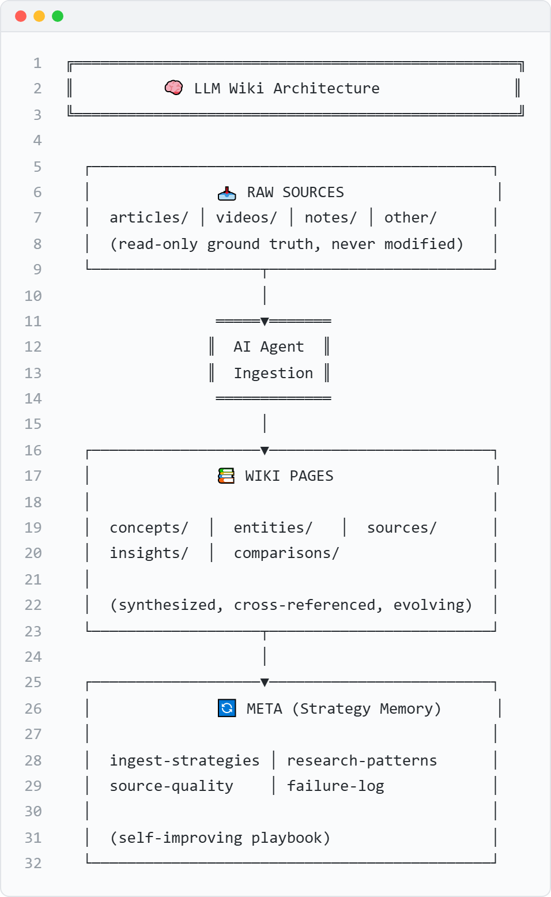

# ASCII Art → PNG Renderer

Render ASCII art diagrams into clean, publication-ready PNG images with a code-editor aesthetic.



## Features

- 🎨 **Light & dark themes** — macOS-style title bar with traffic light dots
- 🔢 **Line numbers** — optional, toggleable
- 📐 **Retina resolution** — 2x scale by default
- 🌍 **Full Unicode support** — box-drawing characters, arrows, emoji
- 📝 **Title bar text** — optional diagram title

## Quick Start

```bash
# Install dependency
npm install puppeteer

# Render an ASCII file to PNG
node render.js input.txt output.png

# With options
node render.js input.txt output.png --title "System Architecture" --dark
```

## Usage

```
node render.js <input.txt> <output.png> [options]
node render.js --text "Hello ═══▶ World" output.png [options]
```

### Options

| Flag | Description | Default |
|------|-------------|---------|
| `--title <text>` | Title shown in the title bar | _(none)_ |
| `--no-line-numbers` | Hide line numbers | Show |
| `--dark` | Use dark theme | Light |
| `--scale <n>` | Device scale factor | `2` |
| `--font-size <n>` | Font size in pixels | `14` |

## ASCII Art Tips

Use Unicode box-drawing characters for crisp diagrams:

```
Borders:  ┌ ┐ └ ┘ │ ─ ├ ┤ ┬ ┴ ┼
Heavy:    ╔ ╗ ╚ ╝ ║ ═
Arrows:   → ← ↑ ↓ ▶ ◀ ▲ ▼ ═══▶ ───▶
Emoji:    🚀 🤖 📊 💡 ✅ ❌ ⚠️
```

**Alignment tips:**
- CJK characters (中文) take 2 columns in monospace fonts
- Emoji widths vary — test and adjust spacing
- Keep lines under 80 characters for best readability

## Example

Input (`example.txt`):
```
╔══════════════════════════════════════╗
║        🚀 Three-Phase Plan          ║
╚══════════════════════════════════════╝

  ┌──────────┐     ┌──────────┐     ┌──────────┐
  │ Phase 1  │     │ Phase 2  │     │ Phase 3  │
  │ 👤 Human │═══▶│ 🤖 AI    │═══▶│ 🤖 Full  │
  │ + AI     │     │ + Human  │     │ Autonomy │
  └──────────┘     └──────────┘     └──────────┘
```

```bash
node render.js example.txt output.png --title "Evolution Roadmap"
```

## Dependencies

- [Node.js](https://nodejs.org/) ≥ 16
- [Puppeteer](https://pptr.dev/) — headless Chromium for rendering

## License

MIT
